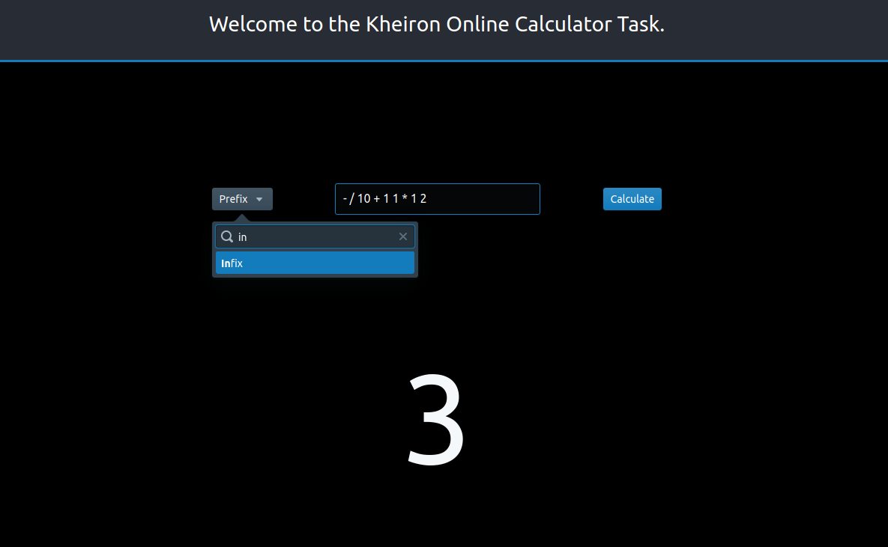

# Calculator

## Instructions

</br>

### Set up

From `/` run:
```bash
npm install
```
</br>
</br>

### Running Tests
From `/` run:
```bash
npm i -D ts-jest @types/jest
npx jest
```
</br>
</br>

### Running it online
From the `/online-calculator/` directory run:
```bash
npm install
npm run start
```
Go to `localhost:3000/`

</br>



</br>

## Solution

</br>

### Prefix
</br>

_Introduction_

Prefix notation is a mathematic notation where the operator precedes the two operands. e.g.

```
- / 10 + 1 1 * 1 2

- / 10 (+ 1 1) (* 1 2)

- (/ 10 (+ 1 1)) (* 1 2)

- (/ 10 2) (* 1 2)

- 5 2

3
```

</br>

_The process_

```js
input = '- / 10 + 1 1 * 1 2'  -> ['-', '/', '10', '+', '1', '1', '*','1', '2']
```

Start with two empty arrays, one for the operands one for the operator.

```js
operands = []; operators = []; answer = 0;
```

- Loop while the input array still has elements.

    - Check if there are two operands and one operator in the respective arrays.

        If yes, perform the operation and insert if to the start of the operand array.

    - Pop the element off the input string array and assign it to one of the two arrays appropriately.

- Once the input array is empty, process the rest of the operands and operators remaining in the arrays.

    - Reverse the operand array to process in the correct order

    - Process the operations adding the result to the final answer on each occasion.

- Return `answer`.

</br>

_Example_
```js
input = '- / 10 + 1 1 * 1 2'  -> ['-', '/', '10', '+', '1', '1', '*','1', '2']

operands = []; operators = []; answer = 0;

"Loop #1"
operands = [2]; operators = []; answer = 0;

"Loop #2"
operands = [2, 1]; operators = []; answer = 0;

"Loop #3"
operands = [2, 1]; operators = ['*']; answer = 0;

"Loop #4 (2 * 1 = 2)"
operands = [2]; operators = []; answer = 0;

"Loop #5"
operands = [2, 1]; operators = []; answer = 0;

"Loop #6"
operands = [2, 1, 1]; operators = []; answer = 0;

"Loop #7"
operands = [2, 1, 1]; operators = ['+']; answer = 0;

"Loop #8 (1 + 1 = 2)"
operands = [2, 2]; operators = []; answer = 0;

"Loop #9"
operands = [2, 2, 10]; operators = []; answer = 0;

"Loop #10"
operands = [2, 2, 10]; operators = ['/']; answer = 0;

"Loop #11 (10 / 2 = 5)"
operands = [5, 2]; operators = []; answer = 0;

"Loop #12"
operands = [5, 2]; operators = ['-']; answer = 0;
```

Reached end of the input array.

Reverse operands array.
```js
operands = [2, 5]; operators = ['-']; answer = 0;
```

Perform operations and add to the answer until no more are to be made.
```js
operands = []; operators = []; answer = 3;

return answer // 3
```

</br>
</br>

### Infix

</br>

_Introduction_

Infix notation is what some might call standard notation. e.g.

`(10 / (1 + 1)) - (1 * 2) = 3`


</br>

_The process_

- Keep track of the parenthesis count for error handling.

- Go through the input from right to left.

    - When a closed branket is found, perform the atomic calculation on  the two operands at the end of the operand array and the operator at the end of the operator array.
    - Append the resultant to the end of the operand array.

- When we reach the end of the input array, the element left is the answer.

</br>


_Example_

```js
(10 / (1 + 1)) - (1 * 2)  

-> ['(','10','/','(','1','+','1',')',')','-','(','1','*','2',')']

operands = [];               operators = [];
operands = [10];             operators = [];
operands = [10];             operators = ['/'];
operands = [10, 1];          operators = ['/'];
operands = [10, 1];          operators = ['/', '+'];
operands = [10, 1, 1];       operators = ['/'];

"Closing bracket!"

operands = [10, 2];          operators = ['/'];

"Closing bracket!"

operands = [5];              operators = [];
operands = [5];              operators = ['-'];
operands = [5, 1];           operators = ['-'];
operands = [5, 1];           operators = ['-', '*'];
operands = [5, 1, 2];        operators = ['-', '*'];

"Closing bracket!"

operands = [5, 2];           operators = ['-'];

"Closing bracket!"

operands = [3];              operators = [];

Answer = 3;

```

<br/>

<br/>

## Alternate solution

It is also possible to solve this using a tree structure, constructing and traversing the tree in different orders depending on if you which to perform prefix, infix or postfix calculations.